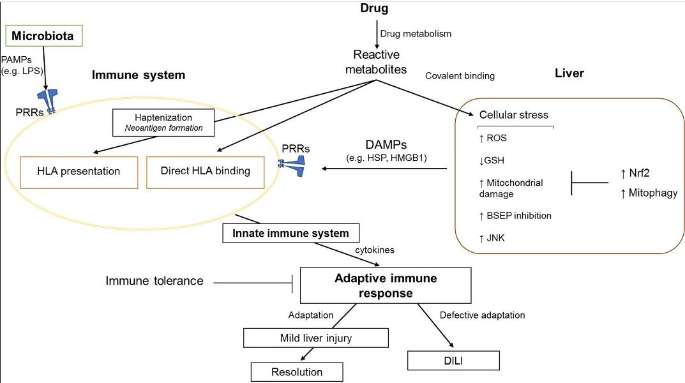
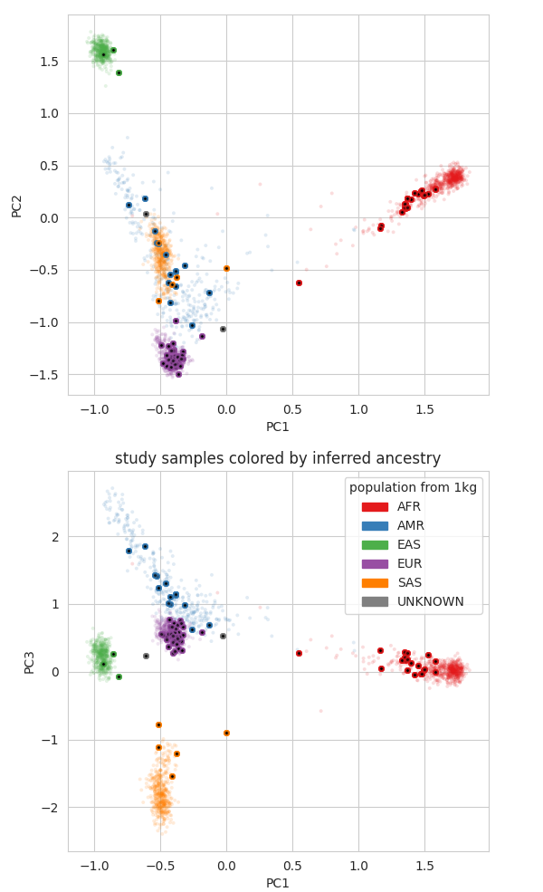
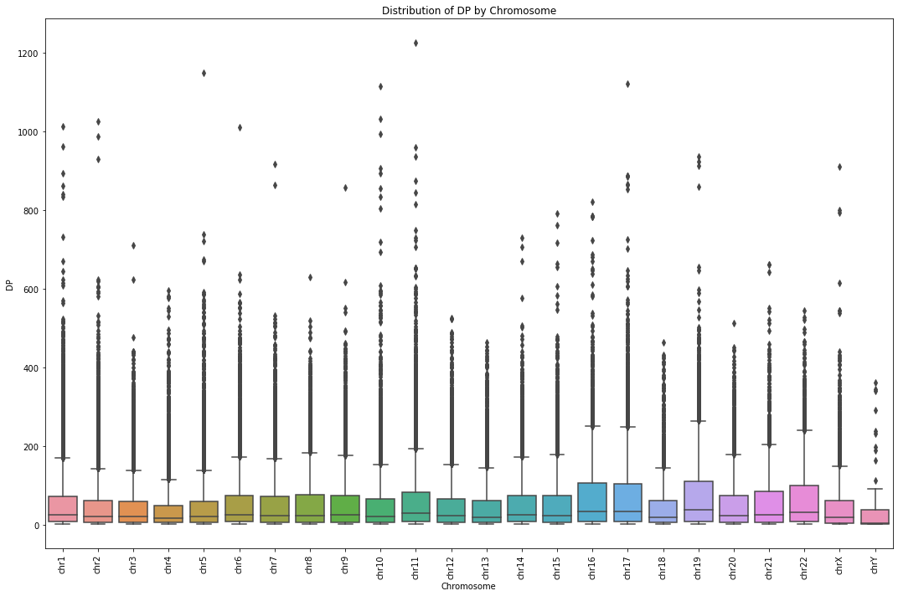
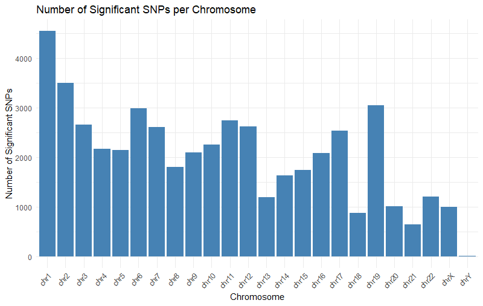
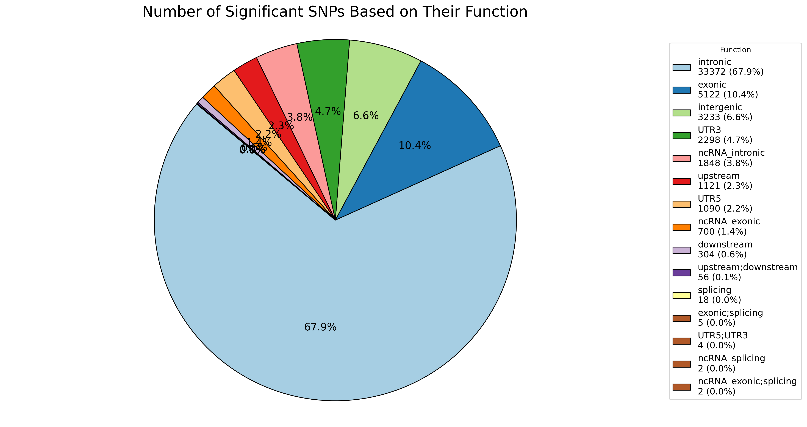
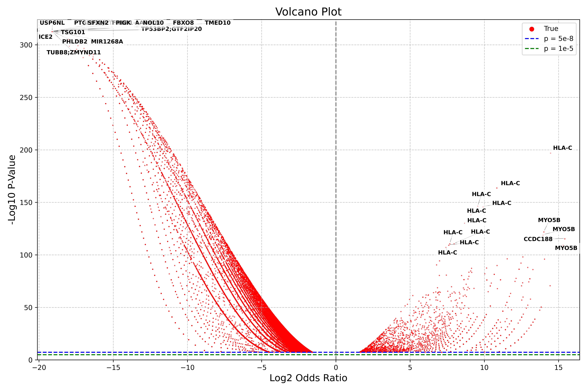
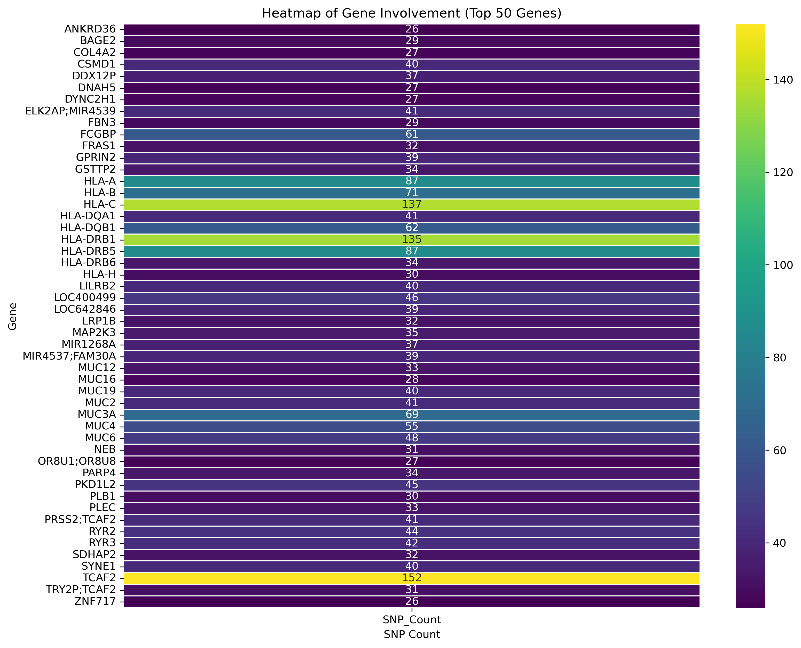

# DILI Whole Exome Sequencing Data Analysis Project
Drug-Induced Liver Injury (DILI) is a significant cause of liver disease and a major concern in clinical practice and drug development. It encompasses a broad spectrum of liver damage caused by pharmaceutical compounds, ranging from mild biochemical abnormalities to acute liver failure. The pathogenesis of DILI is complex and multifactorial, involving direct hepatotoxicity, immune-mediated reactions, and idiosyncratic responses that are often unpredictable. Key factors contributing to DILI include genetic predisposition, underlying liver disease, and interactions with other medications. Genetic factors, such as variations in drug-metabolizing enzymes and immune response genes, play a crucial role in an individual's susceptibility to DILI. Understanding the genetic basis of DILI can provide insights into the mechanisms of liver injury, identify individuals at risk, and guide the development of safer therapeutic agents. Research in this field aims to elucidate the genetic variants associated with DILI, improve early detection, and foster the development of personalized medicine approaches to mitigate the risk of liver injury from medications.

 
Pathogenesis of DILI (Source: https://link.springer.com/article/10.1007/s00204-020-02885-1?fromPaywallRec=true)
## Overview

This project focuses on the analysis of 97 Drug-Induced Liver Injury (DILI) samples, with a subset of 51 samples being of European descent. The race verification was performed using Peddy and is ongoing with PLINK and the 1000 Genomes Project database. The project is divided into three main steps: data filtering and preparation, annotation, and statistical analysis to identify significant SNPs.

- **Race Verification**: Initial verification with Peddy, ongoing verification with PLINK and 1000 Genomes Project.
  
- **Annotation Database**: gnomAD v3.1.2 for comprehensive allele frequency data.
- **Statistical Analysis**: Focused on identifying significant SNPs related to DILI using Fisher's exact test.

## Data Filtering and Preparation

### Step 1: Filtering VCF Files

1. **Filter Samples Based on GQ and DP**
   - Criteria: DP ≥ 20 and GQ ≥ 30.
   - Removed multi-alleles and indels to ensure unique alleles for statistical analysis.

**Figure 2:** This box plot illustrates the distribution of DP values across chromosomes. Each box represents the interquartile range (IQR) of DP values, with the median indicated by the line inside the box. The plot highlights the variability in sequencing depth across different chromosomes, with distinct colors for each chromosome for easy comparison. This visualization helps in assessing the sequencing coverage quality and identifying chromosomes with higher variability or significant outliers.
   
2. **Merge Filtered VCF Files**
   - Used `bcftools` to merge VCF files.
   - Removed remaining multi-allelic SNPs from the merged VCF.
   
3. **Metadata Removal**
   - Removed metadata from the final merged VCF to streamline data analysis.
   - Calculated the number of patients with specific SNPs and their allele counts.
   
   **Script Link**: [Filter and Merge VCFs](script/step_1)

## Annotation

### Step 2: Annotating with ANNOVAR

1. **Convert VCF to ANNOVAR Input**
   - Annotated using ANNOVAR with `refGene`, `avsnp150`, and `gnomad312_genome` databases.
   - Focused on the allele frequency of 34,029 non-Finnish European (NFE) individuals from the gnomAD v3.1.2 database.

2. **Processing Annotated Data**
   - Removed `AAChange.refGene` column for flexibility.
   - Converted annotated CSV file to TSV format.
   - Extracted AF column for NFE population and other necessary columns.
   
   **Script Link**: [Annotate with ANNOVAR](script/step_2)

## Statistical Analysis

### Step 3: Fisher's Exact Test

1. **Merge Data for Statistical Analysis**
   - Merged the outputs from Steps 1 and 2 using unique SNP IDs.
   - Filtered out SNPs without AF information in the gnomAD NFE population.
   - Final dataset: 287,517 SNPs.

2. **Construct Contingency Table**
   - Derived the number of positive and negative alleles for DILI patient population and gnomAD population.
   - Performed Fisher's exact test to calculate p-values and odds ratios.
   - Applied a p-value threshold of \(5 \times 10^{-8}\) for significance.
   - Calculated False Discovery Rate (FDR).
   
   **Script Link**: [Fisher's Exact Test](script/step_3)

## Results

- **Total SNPs Analyzed**: 301,433
- **SNPs with AF in gnomAD NFE**: 287,517
- **Significant SNPs (p < \(5 \times 10^{-8}\))**: 44,856

**Figure 3:** The bar chart illustrates the distribution of significant single nucleotide polymorphisms (SNPs) across different chromosomes. The data indicates that Chromosome 1 harbors the highest number of significant SNPs, exceeding 4500, followed by Chromosome 2 with approximately 4000 significant SNPs. Notable counts are also observed in Chromosomes 6, 7, 10, and 19, each ranging between 2500 and 3000 significant SNPs. In contrast, Chromosomes 3, 5, 9, 13, 15, 17, and 21 exhibit fewer significant SNPs, generally between 1000 and 2000. The sex chromosomes, particularly Chromosome Y, contain the least number of significant SNPs. This distribution highlights potential genomic regions of interest that warrant further investigation in the context of the study.

**Figure 4:** The pie chart illustrates the distribution of significant SNPs by their genomic function, highlighting that intronic SNPs are the most prevalent, constituting 67.9% (33,372 SNPs) of the total. Exonic SNPs follow with 10.4% (5,122 SNPs), while intergenic SNPs account for 6.6% (3,233 SNPs). UTR3 and ncRNA_intronic SNPs represent 4.7% (2,298 SNPs) and 3.8% (1,848 SNPs), respectively.

**Figure 2:** This volcano plot visualizes the association between single nucleotide polymorphisms (SNPs) and drug-induced liver injury (DILI) in 51 European samples. The x-axis represents the log2 fold change in allele frequencies between DILI-positive and DILI-negative groups, while the y-axis displays the -log10(p-value), indicating the statistical significance of each SNP. Red dots denote individual SNPs, with those above the blue and green dashed lines (corresponding to p-value thresholds of 5e-8 and 1e-5, respectively) considered statistically significant. Notably, multiple SNPs in the HLA-C region exhibit high significance, suggesting a strong association with DILI. Other significant SNPs include those in the MYO5B and CCDC188 regions, highlighting potential genetic factors involved in DILI susceptibility.

**Figure 5:** The heatmap shows the top 50 gene with highest involvement, represented by rows. Each row is labeled with the respective SNP count, ranging from 26 to 152. The color scale on the right side of the heatmap indicates the SNP count intensity, with yellow representing the highest counts and purple representing the lowest. Notable peaks in SNP counts are observed with values such as 137, 135, 87, 71, and 152, indicating a higher concentration of significant SNPs in these samples.

## Future Work

- Further validation of significant SNPs in larger datasets.
- Integration with functional genomics data to understand the biological implications of identified SNPs.
- Development of visualization tools to better interpret and present findings.

**Contact Information**:
For further details or collaboration, please contact **Mohammad Sujaur Rahman** at mrahman7@ualr.edu.

---

By following the steps outlined above, this project aims to provide a robust analysis of genetic variants associated with DILI, leveraging advanced bioinformatics tools and statistical methods to ensure accurate and meaningful results.
